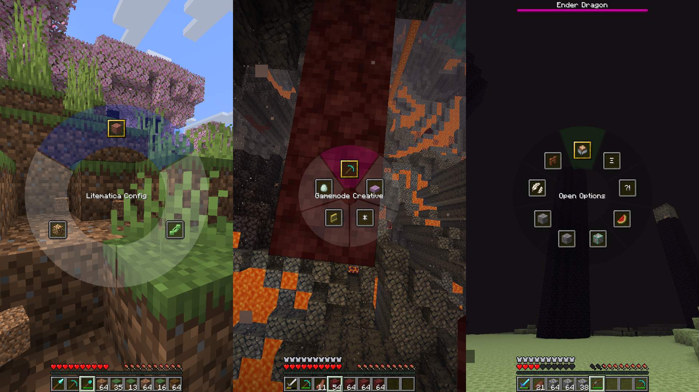
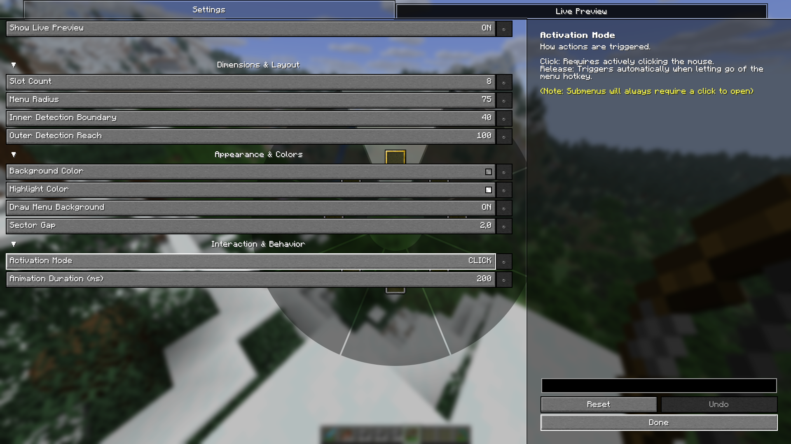
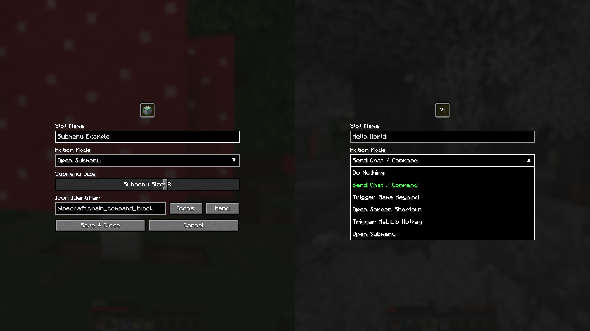
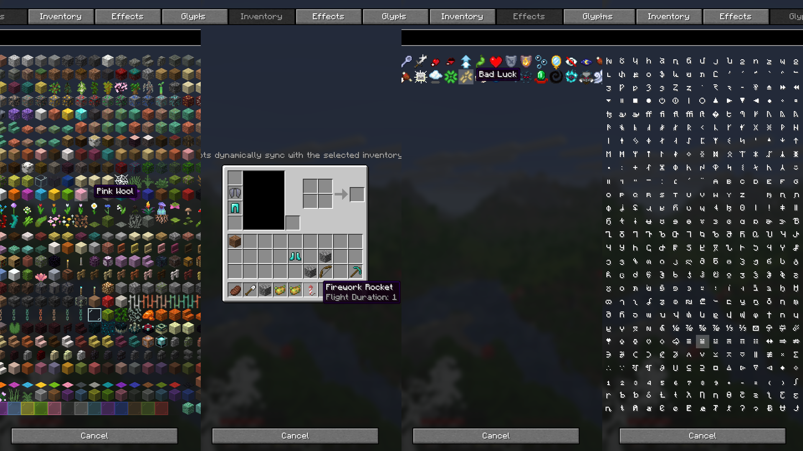

# Radial

### A simple and opinionated Minecraft radial menu mod that works flawlessly out of the box.

## Overview
**Radial** is an opinionated utility mod that brings all your commands and keybinds into one beautifully simple interface. Built for seamless gameplay, it eliminates the need to memorize complex hotkeys by putting your most-used actions in a dynamic radial menu that just works.

## Features

### It's a radial menu

A fast, fluid interface built for speed. Execute actions on click or release, depending on your playstyle. Need to make a quick change? Just right-click any slot to edit it on the fly.

### Complete visual control

Make it yours with a real-time live preview. Adjust the inner and outer radii, change colors, tweak gaps, or hide the background donut entirely to perfectly match your HUD.

### Various functionalities

Bind your slots to whatever you need. Set up chat commands, standard keybinds, submenus, screen shortcuts (like instantly opening the Options menu), or even MaLiLib keybinds for technical players. Name them, or leave them blank for a minimalist look.

### Icon customization

Represent your actions your way. Choose from any item (full NBT support included), sync visually with live inventory slots, display mob effect icons, or type out custom character combinations.

## Version Support & Backports

To keep development focused and maintain a healthy workflow, this mod operates on a **forward-only** development cycle.

- **Active Development:** I am currently only developing and testing for the newest targeted Minecraft version. New features, improvements, and bug fixes will only be applied to this latest version.
- **No Backporting:** I do not backport features or patch bugs for older versions of Minecraft.
- **Older Releases:** Past versions of the mod will remain available to download for players using older modpacks, but they are provided "as-is" and will not receive further updates.
- **Community Contributions:** If you are passionate about a specific older version, feel free to fork the repository and submit a Pull Request! I am more than happy to review and accept community-driven backports, bug fixes, or maintenance updates for older versions.
